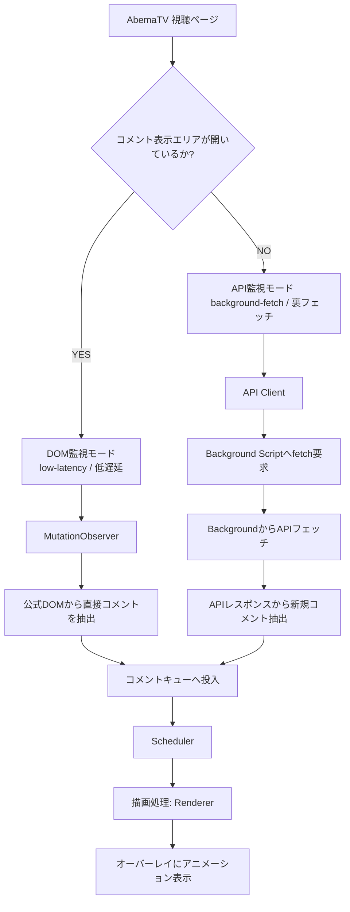

# ACO Horizontal Comment Scroll (v1.0.0) - 機能説明・仕様書

本アドオン（**ACO Horizontal Comment Scroll**）（**ACO**とは **Abema Comment Overlay**の略）は、AbemaTV（`https://abema.tv/*`）のライブ配信および番組において、公式のコメントデータを取得し、動画プレイヤー上に某動画サイト風にコメントを右から左へ流すブラウザ拡張機能（Chrome・Firefox用 MV3仕様）です。

DOM（ドキュメントオブジェクトモデル）監視とAPI（バックグラウンドプロキシ）によるデータ取得を組み合わせた、独自のハイブリッド取得アーキテクチャを搭載しています。

---

## 1. システムアーキテクチャ概要

本アドオンは、AbemaTVのWebページ構成や動作モードに応じて、最適な方法でコメントを抽出します。



### 1.1 ハイブリッド・コメントストリーミング方式

- **DOM監視モード**:
  画面右側の公式コメントエリア（`.com-tv-CommentBlock` 等）が開いている場合、コメントの追加をDOM変更監視 (`MutationObserver`) によりミリ秒単位で検知し、即座に画面上に流します。公式視聴プレイヤー準拠のフルスクリーン（ショートカットキー: f ）使用においてはDOMのコメント要素が維持されており、こちらのモードが継続します。）
- **API監視モード**:
  公式コメントエリアが閉じられている場合（あるいはシアターモード・全画面表示時などでDOMにコメント要素が存在しない場合）、裏で公式APIをポーリング（3秒周期）し、未取得のコメントを取得して流します。
  ※これにより、画面内の公式コメントエリアを閉じてプレイヤーを広げたままでも、コメントを流し続けることが可能です。

  ※OS標準のフルスクリーン（Windows: F11キー / Mac: Control + Command + F）においては状態依存です。コメントエリアが開かれていれば、そのまま全画面となり**DOM監視モード**、閉じていれば**API監視モード**が継続します。

### 1.2 ニュースチャンネル特別処理

ニュース系チャンネル（`/now-on-air/news` または `/now-on-air/abema-news`）は、APIのデータ形式や時間軸の処理が他の番組と異なる特殊仕様となっているため、本アドオンでは**API監視モードを自動的に遮断**します。

- ニュースチャンネル検知時、API取得用の `slotId` は強制的に `null` となり、ポーリングによるAPI通信を完全に停止します。
- コメントエリアが閉じられている場合、「【ニュースチャンネル】コメントを流すには、右のコメント欄を開いてください」というシステムメッセージを画面上に流し、ユーザーへDOM監視モードへの切り替えを促します。
  ※この案内メッセージは、画面遷移時のプレイヤーやオーバーレイの不安定なタイミングによるメッセージ消失を防ぐため、遷移後3秒の待機時間を置いた上で実行されます。また、この初期案内が完了するまでは開閉状態変化による通知（ゲート②）が誤って即座にトリガーされないよう、状態が初期化（`null`）されている間はゲート②をブロックする制御が施されています。

---

## 2. ディレクトリ・ファイル構成と役割

アドオンを構成するファイル群とそれぞれの役割は以下の通りです。

### 2.1 ルートディレクトリ

- **[manifest.json]**
  アドオンのメタデータ（名前、バージョン、権限等）を定義するマニフェストファイル。Firefox MV3仕様に基づいて設計されており、ホスト権限に `api-client` や `akamaized.net` のドメインを含みます。
- **[background.js]**
  サービスワーカー / イベントページ。バックグラウンドで動作し、ネットワーク通信の監視およびAPIのリクエストプロキシを担当します。
- **[content.js]**
  コンテントスクリプトのエントリーポイント。アドオン起動時の初期化、メッセージハンドリング、定期判定などを統括します。
- **[options.html]**
  アドオン設定画面（ポップアップまたはオプションページ）のHTML。
- **[options.js]**
  設定画面のロジック。設定値が変更されるとリアルタイムで `storage.local` へ保存し、開いている視聴ページへ即座に設定を適用します。（現状設定変更後の即時反映は機能しておらず配信ページのリロードが必要です）

### 2.2 `src/` ディレクトリ (コアロジック群)

- **[src/config.js]**
  アドオンのデフォルト設定値を保持し、ローカルストレージ（`chrome.storage.local`）から設定を読み込みます。NG正規表現のプレコンパイルも行います。
- **[src/filter.js]**
  NGワード判定、NG正規表現判定、文字数制限（最小・最大）によるフィルタリング処理を行います。
- **[src/api-client.js]**
  API監視モードにおけるコメントの取得処理。バックグラウンドへ通信処理をリクエストし、重複検知（`seenComments`）やフィルタリングを通してキューへ渡します。
- **[src/dom-observer.js]**
  DOM監視モードにおけるコメントの抽出処理。コメントエリアの開閉状態（アクティブ判定）の監視や、コメントの投稿時間（現在時刻との30秒以上の乖離）チェックなどを行います。
- **[src/news-handler.js]**
  ニュース系チャンネルの自動判定、APIフェッチの遮断制御、およびユーザー誘導メッセージの表示制御（ダブルトリガー）を行います。
- **[src/renderer.js]**
  プレイヤー上に描画領域（オーバーレイ）を設置し、某動画サイト風にコメントを流すレンダリング処理を担当します。衝突を回避して流すレーンを決定するロジックも含みます。
- **[src/scheduler.js]**
  コメントの描画待ちキュー（`commentQueue`）を管理し、コメント量に合わせて流す間隔を動的に調整するスケジューラーです。
- **[src/ui.js]**
  AbemaTVのプレイヤー内のコントロールバー（全画面表示ボタンの左隣）に「コメント表示ON/OFFトグルボタン」を挿入し、表示切り替えイベントをハンドリングします。

---

## 3. 各機能の詳細仕様

### 3.1 コメント取得・監視仕様

#### DOM監視 (Low-latency)

- `document.body` に対して `MutationObserver` を設定し、DOMの変更をリアルタイムで追従します。
- 新しく挿入された要素の中からクラス名 `.com-tv-CommentBlock` を探索します。
- 検出されたコメント要素は `WeakSet`（`seenNodes`）に保持し、二重描画を防ぎます。
- コメントブロック内の `<time>` 要素から `datetime` 属性を取得し、**現在時刻と30秒以上の乖離（遅れまたは進み）があるコメントは過去のログまたは誤検知とみなして破棄**します。

#### API監視 (Background-fetch)

- コメント表示エリアが非アクティブのとき、3秒ごとにポーリング関数がトリガーされます。
- APIから取得した過去 of コメントIDを最大1000件まで `seenComments`（`Set`）にキャッシュし、重複描画を完全に防ぎます。
- コメント表示がOFF（`!showComment`）の際は、ネットワークトラフィックとCPU負荷を抑えるために**通信自体を完全に遮断**します。

### 3.2 ネットワーク監視とURL自律監視（番組・チャンネル遷移の検出）

- **ネットワーク監視**:
  `background.js` にて `chrome.webRequest.onBeforeRequest` リスナーを登録し、プレイヤーが読み込むメディアセグメント（`https://*.akamaized.net/*.m4s*`）のURLを監視して番組スロットID（`slotId`）を自動抽出します。新しい `slotId` が検出されると、直ちにコンテントスクリプトに `slotIdChanged` メッセージを送ります。
- **URL自律監視 (1秒ポーリング) とニュース移行遅延制御**:
  - `content.js` 側で `window.location.href` を1秒ごとにポーリング監視し、SPAの画面遷移によるURL変化を確実に捕捉します。
  - 通常チャンネルからニュースチャンネルへの移動を検知した際、あるいはバックグラウンドからその移行通知を受け取った際は、プレイヤーのDOM構造やオーバーレイが完全にロード・安定するのを待つため、**3秒間の待機時間（デバウンス制御付き）を設定した上で、ニュース案内の状態初期化およびメッセージ送信を実行**します。これにより、遷移直後のオーバーレイの瞬間的な破棄によるメッセージ消失を防ぎます。
  - 待機中にニュースチャンネルから退出した場合は、遅延タイマーをキャンセルして通常チャンネル用の状態へと戻します。

### 3.3 コメント描画・レンダリング仕様

- **オーバーレイ領域の生成とシステムメッセージの保護**:
  - 公式プレイヤーのスクリーンコンテナ（`.com-tv-TVScreen__player__screen`）の中に、`pointer-events: none` および `z-index: 9999` を指定した絶対配置の `div` 要素（`#abema-comment-overlay`）を作成します。
  - プレイヤーの再構成や画面遷移に伴い、古いオーバーレイが破棄・再生成される際、その中で流れていた**システムメッセージ（`data-is-system="true"`）を自動的に救出し、新しく生成されたオーバーレイのコメントキュー先頭へ再投入（再放流）**する保護機構を備えています。これにより、遷移直後のタイミングのズレによる案内メッセージの消失を防ぎます。
- **衝突回避アルゴリズム (某動画サイト風ライク)**:
  - コメントが流れる領域は設定された最大レーン数（`laneCount`）に分割されます。
  - 新しいコメントを描画する際、設定された `duration`（表示時間）と文字幅（`measureCommentWidth` で事前計測）から流れる「速度」を算出します。
  - 各レーンにおいて、「現在流れている最後のコメントに追いつかないか」「後ろから追い抜かれないか」「侵入タイミングが被らないか」を判定します。
  - レーンの走査はランダムに行われ、安全なレーンが見つかった場合にのみそこに描画されます。全レーンが塞がっている場合は、スケジューラーにより100ms後に再トライします。
- **アニメーション制御**:
  - `will-change: transform` を指定した `div` 要素を生成し、`Element.animate` を用いて右端から左端へ等速で並行移動（`translateX`）させます。
  - アニメーション完了時に自動でDOMから要素を削除します。

### 3.4 コメントキュー・スケジュール制御

- 取得したコメントは一度 `commentQueue` 配列にプッシュされます。
- **タイムスタンプ付与と滞留コメントの一括破棄（非アクティブ対策）**:
  - キューに投入されるすべてのコメントオブジェクトに、投入時のタイムスタンプ（`timestamp = Date.now()`）を自動的に付与します。
  - 描画処理が実行される直前、キューの先頭からコメントを走査し、**キュー投入時から30秒以上が経過している古い通常コメントを、描画を行わずにキューから一括破棄（`shift`）**します（システムメッセージは破棄の対象外となり保護されます）。
  - この `while` ループによる一括破棄制御により、ブラウザの非アクティブ化（バックグラウンド移行）によって描画が停止している間に溜まり続けた古いコメントが、アクティブ復帰時に一挙に放出されて画面を埋め尽くす現象（コメントの洪水）を完全に防ぎます。
- **システムメッセージの優先割り込み**:
  システムメッセージ（表示切り替えやスロットID変更、ニュース案内など）は `isSystem: true` として扱われ、キューの先頭へ割り込み（`unshift`）されます。
- **流れる速度（インターバル）の動的調整**:
  - キュー内のコメントが溜まっている場合、コメントが重なりすぎないよう、次のコメントを放流するまでのインターバルを動的に計算します。
  - 計算式: `idealInterval = 3000ms / キューの長さ`
  - インターバルは `40ms`（最小値）〜 `300ms`（最大値）の範囲にクランプされます。
  - 次のキュー先頭がシステムメッセージの場合は、インターバル `0ms` で即座に放流されます。

### 3.5 フィルター機能 (NG機能)

各コメントの表示前に `ns.shouldFilterText` を通してチェックを行います。

- **NGワード**: 指定された文字列がいずれか一部でも含まれていれば非表示（大文字小文字・全角半角は厳密に区別されます）。
- **NG正規表現**: コンパイルされた RegExp オブジェクトを使用して判定します。
- **文字数制限**:
  - 最小文字数（`ngMinLength`）: 文字数がこれを下回るコメントを非表示。
  - 最大文字数（`ngMaxLength`）: 文字数がこれを超えるコメントを非表示（0の場合は無効）。

### 3.6 UI・設定の永続化

- **プレイヤーコントロール連携とSPA再構築対策**:
  - プレイヤーの右下にある全画面表示ボタンの左隣に、アドオン独自のトグルボタンを挿入します。
  - AbemaTVのツールチップデザイン（`com-tv-TVController__tooltip`）や、マウスホバー時の色の輝度変化（`rgba(255,255,255,0.85)` から `#ffffff`）を公式と一致させています。
  - トグルボタンがクリックされると、クリックアニメーション（`scale(0.85)` から `scale(1)`）が発生し、表示ON/OFFが反転します。
  - **SPA再構築・フェードアウト対策**: AbemaTVのコントロールバーが動的に破棄・再構築されたり、フェードアウト後に再表示される際、ボタンの存在チェックを「現在アクティブなコントロールグループ内にボタンが物理的に含まれているか（`contains`）」という厳格な検証にすることで、ボタンの消失や無効化を防ぎます。また、古い破棄されたコントロールグループに浮いている無効なボタンが残っている場合は、重複挿入を防ぐため自動的に親ラッパーごとクリーンアップ（削除）した上で新しいバーに再配置します。
- **設定値の保存とリアルタイム反映**:
  - 設定の変更（ポップアップやオプション画面でのスライダー・テキスト操作）は `chrome.storage.local` に保存され、コンテントスクリプト側で `chrome.storage.onChanged` またはストレージの再ロードを介して、アクティブな視聴ページにリロードなしで即座に適用されます。
  - コメント表示をOFFに切り替えた瞬間、描画領域のクリーンアップが行われ、ONに切り替えた瞬間にはシステムメッセージとともに直ちにコメント取得が再開されます。

---

## 4. データフロー概要

```
[DOMの追加検知]
       │
       ▼
[時間の妥当性チェック (±30秒以内)] ──(乖離あり)──> [破棄]
       │
       ▼
[テキストフィルター (NGワード/正規表現/文字数)] ──(合致)──> [破棄]
       │
       ▼
[コメントキュー (Scheduler)]
       │
       ▼
[衝突回避判定 (Renderer)] ──(衝突あり)──> [100ms後に再試行]
       │
       ▼
[画面描画 (CSS Animation)]
```
